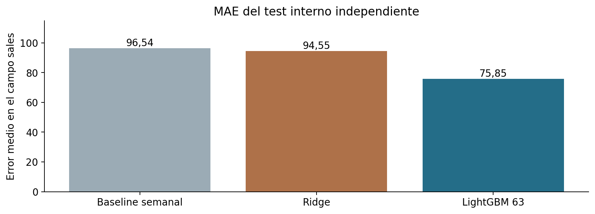

# Predicción de ventas en Corporación Favorita

**Adel Toutouh El Bouchti · Trabajo Final de Máster · Data Science e Inteligencia Artificial**

He desarrollado una previsión diaria por tienda y familia de producto con el dataset **Store Sales – Time Series Forecasting**. El proyecto incluye preparación de datos, análisis, comparación de modelos, evaluación temporal y un informe nativo de Power BI. El ejemplo reproduce una previsión hecha al cierre del 15 de agosto de 2017; no es una previsión actual de la empresa.

## Archivos para la entrega

- [Memoria final en PDF](docs/TFM_Favorita_Adel_Toutouh.pdf) y [versión Markdown](docs/memoria_tfm.md).
- [Presentación final](docs/TFM_Favorita_presentacion_final.pptx), con seis diapositivas y notas del orador, y [guion de cinco minutos](docs/guion_defensa_5min.md).
- [Informe Power BI con los datos guardados — Favorita.pbix](powerbi/Favorita.pbix), [proyecto editable PBIP](powerbi/Favorita.pbip) e [instrucciones](powerbi/README.md).
- [Notebook de datos y EDA](notebooks/01_datos_y_eda.ipynb) y [notebook de resultados](notebooks/02_modelado_y_resultados.ipynb), ejecutados y con salidas guardadas.
- [Resultado final y relación con las entregas](docs/entregas/06_resultado_final.md). Las cinco entregas anteriores se conservan como documentación del diseño.

## Resultado principal

El modelo se ha elegido con tres bloques de validación, todos de 16 días. Después se ha evaluado en un **test interno independiente del 31/07/2017 al 15/08/2017**, con 28.512 observaciones por modelo.

| Modelo | MAE | RMSE | WAPE | RMSLE |
|---|---:|---:|---:|---:|
| Baseline semanal | 96,54 | 348,38 | 20,67% | 0,617 |
| Ridge | 94,55 | 282,45 | 20,24% | 1,511 |
| LightGBM, 63 hojas | **75,85** | **276,00** | **16,24%** | **0,426** |

LightGBM reduce el MAE un **21,43%** frente al baseline. Mejora en las 33 familias y en 51 de las 54 tiendas del test interno. La comparación completa de las dos configuraciones de LightGBM está en [metrics_summary.csv](outputs/metrics_summary.csv).

El forecast final contiene **28.512 predicciones** para el 16–31 de agosto de 2017. [submission.csv](outputs/submission.csv) conserva el orden del archivo de ejemplo de Kaggle. Ese bloque oficial no incluye ventas reales: aquí no se calcula una puntuación oficial de competición.



## Cómo reproducirlo

Se ha ejecutado con **Python 3.12.14**, CPU, cuatro hilos y semilla 42. Los paquetes están fijados en [requirements.txt](requirements.txt). No se utilizan servicios de pago ni una API de IA para entrenar.

```bash
python -m venv .venv
# Linux/macOS
source .venv/bin/activate
# Windows PowerShell: .venv\Scripts\Activate.ps1
python -m pip install -r requirements.txt
python scripts/download_data.py
python run_pipeline.py
python scripts/eda.py
python scripts/build_powerbi.py
python scripts/build_notebooks.py
python -m pytest -q
```

El entrenamiento y los forecasts han tardado unos **295 segundos** en el entorno de la ejecución; el tiempo depende del equipo. Se necesitan varios GB de RAM. La descarga automática usa una copia pública fijada a un commit y comprueba el hash del ZIP. También se pueden descargar los siete CSV desde Kaggle y colocarlos en `data/raw/`. La procedencia y sus límites se explican en [data/README.md](data/README.md).

En un entorno que impida abrir sockets de un kernel Jupyter se pueden regenerar las salidas de los notebooks con `python scripts/build_notebooks.py --in-process`. Ambos métodos ejecutan sus celdas; los notebooks revisan las salidas del pipeline, mientras que el entrenamiento completo está en `src/`.

Para regenerar la memoria y las figuras de resultados:

```bash
python -m pip install -r requirements_docs.txt
python scripts/build_report.py
```

La presentación es un archivo editable independiente. No es necesaria para ejecutar el modelo.

## Validación y prevención de fuga

- Ventana de entrenamiento de 730 días; cortes de validación: 12/06, 28/06 y 14/07 de 2017. Corte del test interno: 30/07/2017.
- Cada modelo predice los 16 días completos utilizando su propio histórico de predicciones. No accede a ventas reales posteriores al corte.
- Lags 1, 7, 14 y 28 y medias anteriores, calculados sobre un calendario diario. Las fechas sin registro se mantienen como desconocidas.
- No se usan transacciones ni petróleo realizados en fechas futuras. Las promociones futuras se consideran conocidas, como en el archivo del concurso; no hay snapshots históricos para comprobar cuándo fueron planificadas.
- La configuración ganadora queda registrada en [selection.json](outputs/selection.json) antes del test interno. Se exige al menos un 5% de mejora media de MAE y mejora en cada bloque; en caso contrario se conserva el baseline.
- Las ocho [pruebas automatizadas](tests/test_temporal.py) comprueban recursión, calendario, ausencia de etiquetas futuras, aislamiento entre modelos, claves y festivos.

## Power BI

Para consultar el resultado, abre **[Favorita.pbix](powerbi/Favorita.pbix)** en Power BI Desktop: contiene el modelo importado y los datos guardados, por lo que no hace falta ejecutar PowerShell ni entrenar para visualizarlo. Se conserva también el proyecto **PBIP**, el informe PBIR, el modelo semántico y los CSV que consume. Tiene una página de previsión y otra de evaluación, filtros de tienda, familia y modelo, y exportación de previsiones. Se abre `powerbi/Favorita.pbip` en Power BI Desktop para actualizar el modelo.

La estructura se ha validado contra los esquemas oficiales de Microsoft y las métricas se han reconciliado con los CSV. El alumno ha abierto el proyecto en Power BI Desktop y ha entregado el PBIX con datos: su captura muestra MAE 75,85 y WAPE 16,2%, coherentes con Python. Se ha comprobado la integridad del archivo, sus dos páginas y la presencia del modelo embebido. La captura no confirma un refresco explícito ni todos los filtros y exportaciones; esas comprobaciones siguen pendientes. Evidencia: [desktop_review.json](outputs/desktop_review.json). Las rutas web están configuradas para este repositorio; existe una opción de lectura local.

## Organización

| Carpeta | Contenido |
|---|---|
| `src/` | Calidad, capa gold, variables, modelos, métricas y ejecución |
| `scripts/` | Descarga, EDA, notebooks, memoria y proyecto Power BI |
| `data/` | Procedencia, checksums y diccionario; raw/processed/gold se regeneran |
| `notebooks/` | Análisis y revisión de resultados con salidas ejecutadas |
| `outputs/` | Métricas globales y por segmento, selección y forecast final |
| `powerbi/` | Proyecto nativo, modelo semántico, informe y datos de consulta |
| `docs/` | Memoria, presentación, guion, figuras y entregas anteriores |
| `tests/` | Ocho pruebas del protocolo temporal y de calidad |

Los CSV originales, los Parquet completos, los modelos entrenados y la caché local quedan fuera de Git. Se incluyen los extractos necesarios para que Power BI pueda cargar el informe y revisar las predicciones.

## Alcance y límites

La variable objetivo es `sales`: son ventas observadas, no demanda insatisfecha. El dataset no contiene stock, precios ni costes para convertir la previsión en compras o ahorro. Las familias pueden mezclar unidades y peso: el MAE está en la escala de `sales` y los totales globales no son euros ni una unidad física homogénea. El buen resultado en cuatro bloques próximos no demuestra que el modelo funcione igual en cualquier año. La memoria recoge estos límites y los pasos que seguiría para ampliar la evaluación.
