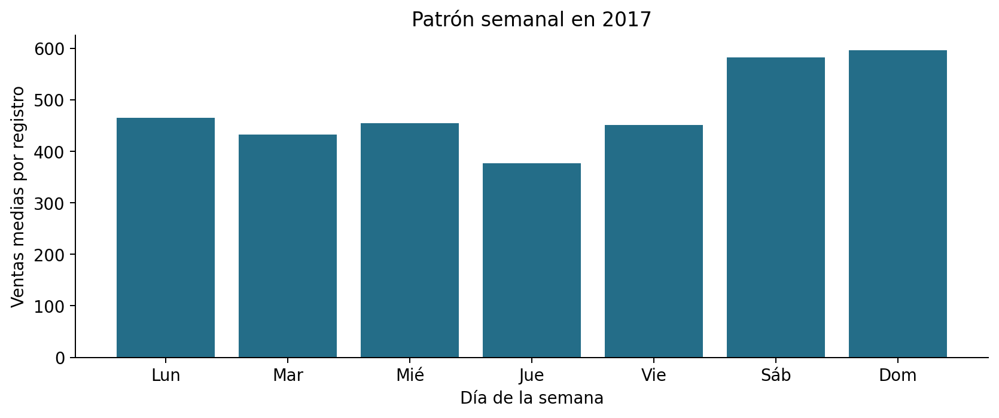
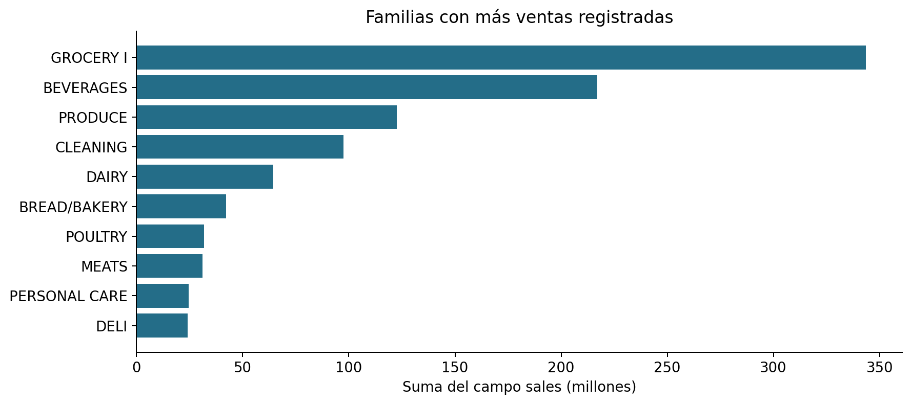
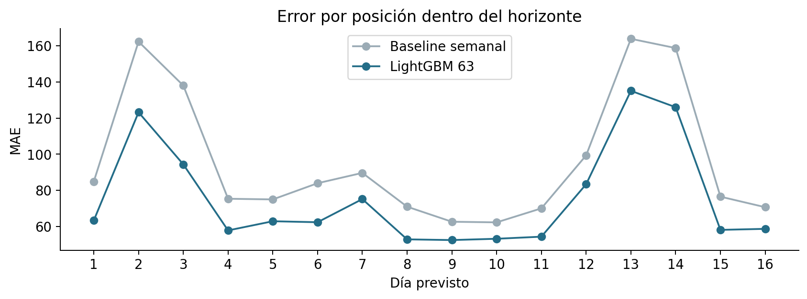
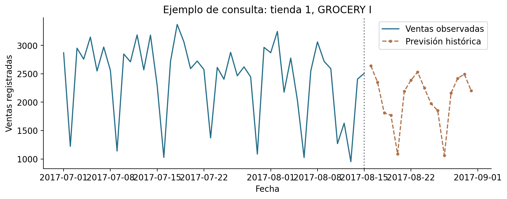

# Predicción de ventas en Corporación Favorita

**Trabajo final de máster**

**Autor:** Adel Toutouh El Bouchti

**Fecha:** 4 de octubre de 2026

## Resumen y objetivo

En este trabajo he desarrollado un sistema para estimar las ventas diarias de Corporación Favorita por tienda y familia de producto. El horizonte es de 16 días, igual que el periodo de test del dataset Store Sales - Time Series Forecasting de Kaggle [1]. La unidad de trabajo es una combinación de fecha, tienda y familia.

La idea inicial del proyecto hablaba de demanda. Al revisar los datos, he limitado el objetivo a ventas registradas. Sin inventario ni roturas de stock no se puede calcular la demanda insatisfecha. También he mantenido visible que se trata de una demostración histórica: el último dato observado es de agosto de 2017.

La solución incluye preparación de datos en Python, comparación de un baseline semanal, Ridge y dos configuraciones de LightGBM, evaluación temporal y un proyecto de Power BI. En el test interno, el modelo elegido obtiene un MAE de 75,85, frente a 96,54 del baseline. La reducción es del 21,43% y el WAPE pasa de 20,67% a 16,24%.

El objetivo principal es comprobar si un modelo aporta una mejora frente a una regla sencilla bajo las mismas condiciones de uso. Como objetivos de apoyo, he definido una capa de datos trazable, he estudiado el patrón semanal y los ceros, he medido el error por horizonte y he preparado una consulta de previsiones por tienda y familia.

Palabras clave: predicción de ventas, series temporales, validación temporal, LightGBM, Power BI.

## 1. Problema y alcance

El usuario previsto es una persona que analiza ventas o revisa la planificación de una tienda. Necesita consultar una previsión concreta y compararla con el comportamiento reciente, sin tener que abrir las salidas del modelo directamente en Python. Por eso el producto combina la curva de ventas, el detalle diario y métricas obtenidas en un periodo con valores reales conocidos.

La salida es un valor numérico no negativo de sales por fecha, tienda y familia. El forecast final contiene 54 tiendas por 33 familias por 16 días, es decir, 28.512 filas. No se estima el beneficio, el ahorro por inventario o una cantidad óptima de compra, porque faltan precios, costes, stock y plazos de reposición.

El campo sales admite valores fraccionarios. El dataset combina familias con productos vendidos por unidades y otros vendidos por peso. Por tanto, las sumas entre familias son una agregación del campo registrado, no euros ni una cantidad física homogénea. El MAE global permite comparar modelos sobre las mismas filas, pero su interpretación operativa exige revisar la familia correspondiente.

Una referencia útil es repetir la venta del mismo día de la semana anterior. Para justificar un modelo más complejo, he pedido una mejora mínima del 5% en el MAE medio de validación y una mejora en cada bloque. El umbral es una regla de este proyecto, no un requisito económico demostrado de Corporación Favorita.

El MVP funciona con previsiones calculadas previamente. Cambiar un filtro en Power BI no reentrena el modelo. Tampoco he añadido una API, una aplicación web o explicaciones con IA generativa: para este alcance, los CSV y las métricas dan suficiente trazabilidad.

## 2. Datos y comprobaciones de calidad

La fuente de referencia es la competición de Kaggle [1]. Para esta ejecución he utilizado una copia pública versionada de los siete CSV, identificada por URL, commit y hashes SHA-256 en data/source_manifest.json. Las dimensiones, columnas y periodos se han comprobado localmente. No se ha cotejado su hash con una descarga autenticada de Kaggle. El repositorio no vuelve a distribuir el histórico raw completo.

train.csv tiene 3.000.888 filas, seis columnas, 54 tiendas, 33 familias y 1.782 series. Abarca del 1 de enero de 2013 al 15 de agosto de 2017. test.csv contiene las 28.512 combinaciones del 16 al 31 de agosto de 2017, sin sales. stores.csv aporta ciudad, provincia, tipo y cluster. Las tablas auxiliares describen transacciones, petróleo y festivos.

La clave fecha-tienda-familia no tiene duplicados ni nulos en las columnas obligatorias. No he encontrado ventas negativas. El 31,30% de los registros tiene ventas cero, por lo que no he usado MAPE como medida principal. Los ceros se conservan: el dato no permite saber si representan poca venta, cierre o falta de producto.

Faltan cuatro fechas completas: el 25 de diciembre de 2013, 2014, 2015 y 2016. La cuadrícula temporal mantiene esas fechas con valor desconocido para construir los retardos por calendario. No he añadido esas filas como ventas observadas ni las he convertido en cero. Un shift de siete filas podría dar un retardo incorrecto alrededor de estas fechas.

El petróleo tiene 43 valores nulos en su columna de precio. Se prepara con relleno hacia delante y una marca de imputación, conservando cualquier nulo inicial. Las transacciones ausentes se dejan nulas y marcadas. Ambas variables se reservan para inspección; los modelos no usan transacciones ni precios futuros realizados.

| Archivo | Filas | Uso |
| --- | --- | --- |
| train.csv | 3.000.888 | Ventas y promociones históricas |
| test.csv | 28.512 | Contexto del forecast final |
| stores.csv | 54 | Dimensión de tiendas |
| transactions.csv | 83.488 | Inspección histórica |
| holidays_events.csv | 350 | Calendario por ámbito |
| oil.csv | 1.218 | Inspección y trazabilidad |
| sample_submission.csv | 28.512 | Orden y formato de salida |

## 3. Análisis exploratorio

He utilizado todo el histórico para describir el dataset. Este análisis no entrena los modelos ni ajusta los hiperparámetros con el test interno. La selección utiliza exclusivamente los tres bloques temporales de validación descritos más adelante.

En 2017 las ventas medias por registro son mayores en sábado (582,07) y domingo (596,17) que en los días laborables. Este patrón apoya la comparación con un baseline semanal y la inclusión del día de la semana. No presupone que todas las tiendas y familias tengan exactamente el mismo comportamiento.

GROCERY I concentra el 31,99% de la suma del campo sales. La diferencia de escala entre familias es grande: la mediana global es 11,00, el percentil 99 es 5.507,00 y el máximo es 124.717,00. Por ello he combinado métricas globales con resultados por familia y tienda.

Las promociones presentan una asociación descriptiva con ventas distintas, pero no he interpretado la diferencia de medias como un efecto causal. Las promociones pueden coincidir con productos, tiendas o fechas que ya tienen una demanda diferente. La tabla promotion_by_family.csv conserva medias y tamaños de grupo para poder revisar esa comparación.





## 4. Capas de datos y transformaciones

He seguido la organización propuesta en la entrega 3: raw contiene los CSV originales, processed las tablas auxiliares limpias y gold las tablas finales. Parquet reduce el tamaño de almacenamiento y conserva los tipos mejor que CSV para las fases de Python. CSV se utiliza en las salidas que consumirá Power BI.

gold_sales_history.parquet mantiene una fila por fecha, tienda y familia, con la venta real y su contexto. gold_forecast_horizon.parquet contiene las combinaciones futuras y las variables conocidas, sin ventas reales. Cada join comprueba su cardinalidad y el número de filas antes y después. No se permite que una tabla auxiliar multiplique las ventas.

Los festivos se expanden según su ámbito: nacional para todas las tiendas, regional para su provincia y local para su ciudad. Antes del join, los eventos se agrupan en una sola fila por tienda y fecha. Un festivo original con transferred=True no cuenta como efectivo. La fila Transfer marca la fecha trasladada. Event y Work Day se mantienen como indicadores separados.

La capa gold conserva el petróleo y las transacciones para trazabilidad, pero las 27 variables del modelo excluyen sus valores del mismo día. En el horizonte final, el petróleo de gold usa el último precio conocido al corte. Esta política evita presentar el precio futuro realizado como si hubiera estado disponible.

Las decisiones que cambian respecto a los documentos iniciales quedan registradas en docs/entregas/06_resultado_final.md. Se conservan las cinco entregas anteriores y su mockup como evidencia de la planificación, sin presentar sus cifras ilustrativas como resultados del modelo.

| Capa o salida | Clave | Consumidor |
| --- | --- | --- |
| gold_sales_history | Fecha + tienda + familia | EDA y entrenamiento |
| gold_forecast_horizon | Fecha + tienda + familia | Predicción final |
| holidays_store_date | Fecha + tienda | Join sin duplicados |
| forecast / predicciones.csv | Fecha + tienda + familia + modelo | Power BI |
| validacion.csv | Fecha + tienda + familia + modelo | Métricas del test interno |

## 5. Variables y modelos comparados

He planteado un modelo global para todas las series. Las categorías de tienda, familia y combinación tienda-familia permiten distinguirlas, mientras que las variables temporales comparten información entre series. No se usan id ni textos de descripción del festivo como variables predictoras.

Las variables incluyen calendario, promociones, metadatos de tienda, retardos de 1, 7, 14 y 28 días y resúmenes de las ventas anteriores. Las medias de 7 y 28 días y la desviación de 28 días excluyen la venta del día actual. weekday_mean_4 combina los cuatro días equivalentes de semanas previas. missing_lags conserva cuántos retardos no estaban disponibles.

El baseline repite la venta de siete días antes. Si la fecha correspondiente no tiene observación, utiliza la media conocida de los últimos 28 días. A partir del octavo día, el valor de hace siete días puede estar dentro del horizonte y el baseline reutiliza su propia predicción.

Ridge es la alternativa lineal sencilla [3]. Usa StandardScaler en las variables numéricas y OneHotEncoder en las categorías. El preprocesado se ajusta solo sobre el entrenamiento de cada corte. Se ha utilizado alpha=30, solver lsqr y un máximo de 300 iteraciones. No he buscado muchos valores de alpha.

LightGBM representa la alternativa no lineal [4]. He comparado dos configuraciones con 31 y 63 hojas, 300 y 400 árboles respectivamente, learning_rate=0,05 y un mínimo de 120 observaciones por hoja. La función objetivo es el error absoluto, coherente con el MAE principal. Se han fijado la semilla 42 y cuatro hilos. Los modelos predicen en la escala original de sales y las salidas negativas se recortan a cero.

| Grupo | Variables o criterio |
| --- | --- |
| Categorías | Tienda, familia, serie, ciudad, provincia, tipo, cluster, día semanal y mes |
| Calendario | Tendencia temporal, seno/coseno anual, quincena/fin de mes y festivos |
| Promociones | log1p(onpromotion) e indicador de promoción |
| Histórico | Lags 1/7/14/28, medias 7/28, desviación 28 y media del mismo día semanal |
| Disponibilidad | Número de lags ausentes; valores desconocidos convertidos a cero en el vector |

## 6. Validación temporal y prevención de fuga

La validación reproduce una consulta de 16 días desde una fecha de corte. No he repartido las filas aleatoriamente, porque eso mezclaría observaciones futuras con anteriores. La evaluación con origen temporal desplazado permite medir previsiones a varios pasos usando solo información previa [2].

En cada corte se entrena con una ventana de 730 días de calendario. Las fechas sin observaciones no aportan etiquetas al entrenamiento. Cada bloque de evaluación contiene 28.512 filas y no se solapa con el siguiente. Hay tres bloques de validación para comparar alternativas y un test interno posterior que se reserva para la evaluación final.

La función de forecast recibe una copia del histórico hasta el corte, el contexto conocido y el número de días. No recibe las ventas reales del bloque futuro. Va prediciendo día a día y añade sus propias salidas a un estado separado para cada modelo. Solo después de generar los 16 días se adjuntan las ventas reales para calcular métricas.

Las promociones futuras se consideran conocidas en la fecha de corte. Esta es una hipótesis operativa coherente con onpromotion en el test de Kaggle, aunque el histórico no aporta instantáneas del plan de promociones. Un despliegue real necesitaría comprobar esa disponibilidad. No se utilizan transacciones futuras ni petróleo futuro realizado.

Antes de abrir el test interno, selection.json deja fijado el modelo con menor MAE medio que supera el 5% de mejora y mejora en cada validación. Si ninguno cumple, se conserva el baseline. Esta regla permite separar la selección de la última comprobación y evita elegir retrospectivamente con el resultado del test.

| Corte | 16 días evaluados | Función |
| --- | --- | --- |
| 2017-06-12 | 2017-06-13 a 2017-06-28 | Validación |
| 2017-06-28 | 2017-06-29 a 2017-07-14 | Validación |
| 2017-07-14 | 2017-07-15 a 2017-07-30 | Validación |
| 2017-07-30 | 2017-07-31 a 2017-08-15 | Test interno |

## 7. Métricas y criterio de selección

MAE es la media de |predicción - venta real|. Se expresa en la escala del campo sales y es la medida principal para elegir el modelo. RMSE es la raíz de la media de los errores al cuadrado y permite detectar una mayor exposición a errores grandes.

WAPE se calcula como suma de errores absolutos dividida entre la suma de ventas reales. No es el promedio de los porcentajes individuales ni un porcentaje de aciertos. Si el denominador es cero, la función devuelve un valor indefinido. Al dar más peso a las series de mayor volumen, se acompaña de resultados por familia.

RMSLE es la raíz del error cuadrático medio entre log1p(predicción) y log1p(venta). Se incluye como métrica secundaria, ya que la competición utiliza una evaluación logarítmica [1]. El sesgo relativo es la suma de predicción menos venta, dividida por las ventas totales. Un valor negativo indica subestimación agregada.

La mejora frente al baseline se define como 1 - MAE_modelo / MAE_baseline. LightGBM 63 reduce el MAE en las tres validaciones: 23,48%, 25,73% y 13,34%. Su MAE conjunto de validación es 58,66, frente a 74,46 del baseline. Estas tres mejoras superan el umbral y justifican la selección antes del test.

He limitado la búsqueda a dos configuraciones de LightGBM para que la comparación sea manejable y fácil de reproducir. No se ha usado early stopping con el test interno, una búsqueda extensa de hiperparámetros o una puntuación de Kaggle para decidir el ganador.

| Corte | Baseline MAE | Ridge MAE | LGBM 31 MAE | LGBM 63 MAE |
| --- | --- | --- | --- | --- |
| 2017-06-12 | 77,25 | 83,55 | 60,50 | 59,11 |
| 2017-06-28 | 78,82 | 79,07 | 60,69 | 58,54 |
| 2017-07-14 | 67,29 | 71,98 | 59,77 | 58,32 |

## 8. Resultado del test interno

El test interno abarca del 31 de julio al 15 de agosto de 2017. El modelo seleccionado, LightGBM 63, obtiene MAE=75,85, RMSE=276,00 y WAPE=16,24%. Reduce el MAE del baseline un 21,43%. Esta mejora se mantiene en un bloque que no se utilizó para escoger el modelo.

Ridge obtiene un MAE de 94,55, una mejora pequeña frente al baseline. Aunque su RMSE también baja, su RMSLE es 1,511, peor que el baseline (0,617). Medir solo RMSE habría ocultado ese empeoramiento en la escala logarítmica.

El sesgo agregado de LightGBM es -0,60%. Un sesgo cercano a cero no significa que cada día o familia tenga poco error: sobreestimaciones y subestimaciones pueden compensarse. Por esa razón, las métricas del dashboard se calculan sobre el detalle y mantienen los filtros de tienda y familia.

La tabla también muestra la configuración LightGBM 31 para dar trazabilidad a la comparación. El modelo para el forecast final sigue siendo el elegido previamente. No he cambiado parámetros tras ver el resultado del test interno.

| Modelo | MAE | RMSE | WAPE | RMSLE |
| --- | --- | --- | --- | --- |
| Baseline semanal | 96,54 | 348,38 | 20,67% | 0,617 |
| Ridge | 94,55 | 282,45 | 20,24% | 1,511 |
| LightGBM 31 | 79,08 | 282,73 | 16,93% | 0,432 |
| LightGBM 63 | 75,85 | 276,00 | 16,24% | 0,426 |


## 9. Errores por horizonte y segmentos

LightGBM mejora el MAE del baseline en 33 de 33 familias y en 51 de 54 tiendas del test interno. Las tiendas 7, 25, 37 no mejoran. La decisión global no elimina la necesidad de revisar estos segmentos.

La menor mejora por familia aparece en PRODUCE, aproximadamente un 7,28%. Las diferencias entre familias son relevantes porque tienen escalas y muchos ceros distintos. Los CSV metrics_by_family.csv y metrics_by_store.csv conservan el análisis completo, incluyendo WAPE y sesgo.

El error por posición del horizonte no crece de forma uniforme. En este bloque destacan los días 2, 13 y 14. El día 16 tiene un MAE de 58,70 y el día 1 de 63,34. No sería correcto afirmar, a partir de este resultado, que el error aumenta siempre con la distancia al corte.

La predicción recursiva puede propagar errores, pero en esta curva también intervienen fechas y volúmenes distintos. Para separar ambos efectos harían falta más ventanas y, como alternativa, un modelo directo por horizonte. He mostrado la curva observada, sin convertirla en una regla general o en un intervalo de confianza.

La importancia de variables utiliza el gain de los árboles del modelo final. Sirve para describir qué variables ayudan a construir el modelo, pero no prueba causalidad ni explica por sí sola una predicción individual. Las variables históricas suelen compartir información y su importancia puede repartirse entre ellas.



## 10. Forecast final y consulta en Power BI

Después de terminar la evaluación se reentrena con el histórico conocido hasta el 15 de agosto de 2017, manteniendo la ventana de 730 días. El pipeline genera 28.512 predicciones por modelo y un submission.csv con las 28.512 filas del modelo seleccionado en el orden de sample_submission.csv. No se ha enviado una participación a Kaggle.

El test oficial no incluye ventas reales. Por tanto, no hay una métrica local verificable para el 16-31 de agosto. Las cifras de precisión mostradas en Power BI corresponden al test interno 31 de julio-15 de agosto, indicado expresamente en el informe. El ejemplo de la tienda 1 y GROCERY I ilustra una consulta, no una selección de casos para medir el error.

El proyecto powerbi/Favorita.pbip incluye el informe PBIR, el modelo semántico model.bim, relaciones, consultas de Power Query y medidas DAX. La primera página permite filtrar tienda, familia y modelo, consultar la curva histórica y prevista, ver los KPI y exportar el detalle diario desde el menú del visual. La segunda compara modelos y muestra MAE por horizonte y familia.

El modelo tiene dimensiones de calendario, tienda, familia y modelo, con relaciones de uno a muchos y filtrado en una dirección hacia histórico, predicciones y validación. Las medidas de error eliminan el filtro del calendario del forecast para no confundir fechas futuras con el test interno, pero conservan tienda, familia, modelo y el día del horizonte.

Los archivos y referencias del proyecto se han comprobado con los esquemas JSON oficiales de Microsoft [5]. También se han revisado claves, relaciones y columnas contra los CSV. El proyecto se ha abierto en Power BI Desktop y la captura muestra datos y métricas coherentes con Python. Se entrega Favorita.pbix con el modelo y los datos guardados. El paquete es íntegro y contiene las dos páginas. Quedan por confirmar un refresco explícito, todos los filtros y la exportación desde la interfaz. La apertura está registrada en outputs/desktop_review.json.



## 11. Reproducción y organización del repositorio

La ejecución registrada utiliza Python 3.12.14, pandas 2.2.3, NumPy 2.3.5, scikit-learn 1.8.0, LightGBM 4.6.0 y PyArrow 20.0.0. Las versiones directas están fijadas en requirements.txt. Los archivos fuente utilizados tienen hashes, y run_metadata.json conserva configuración, variables, fechas y tiempo de ejecución.

El pipeline completo tardó 294,7 segundos en el entorno de esta ejecución. Este tiempo no garantiza el mismo rendimiento en otro ordenador. Se utilizaron cuatro hilos para los modelos y una ventana de dos años para evitar depender de todos los años en cada ajuste.

Las pruebas automáticas comprueban ocho reglas: recursión del baseline, ausencia de lectura de ventas actuales o futuras, retardos por calendario, aislamiento del estado de cada modelo, WAPE con denominador cero, festivos por ámbito y traslado, rechazo de duplicados y selección con mejora en todos los bloques. Son pruebas de condiciones que podrían invalidar la evaluación.

Los datos raw, las capas Parquet grandes y los modelos se regeneran y quedan fuera de Git. Se publican las métricas, las previsiones y los CSV compactos necesarios para abrir el dashboard. Los notebooks incluyen salidas ejecutadas y explican el análisis, sin obligar a entrenar de nuevo para ver los resultados.

En Windows puede utilizarse directamente .venv/Scripts/python.exe para evitar depender de la activación de PowerShell. Para consultar la entrega, se abre Favorita.pbix en Power BI Desktop con sus datos guardados. El proyecto Favorita.pbip conserva el formato editable; Actualizar vuelve a cargar las fuentes. Las consultas apuntan por defecto a los CSV públicos de este repositorio. La guía de powerbi/README.md explica también la opción local.

```bash
python -m venv .venv
python -m pip install -r requirements.txt
python scripts/download_data.py
python run_pipeline.py
python scripts/eda.py
python -m pytest -q
python scripts/build_powerbi.py
```

## 12. Limitaciones y trabajo posterior

La principal limitación es la variable objetivo: ventas registradas no equivalen a demanda. Una rotura de stock puede producir ventas bajas, pero el dataset no permite identificarla. Tampoco hay SKU, inventario, precios o costes para evaluar decisiones de compra o beneficios reales.

Los resultados corresponden a datos de 2013-2017 y a cuatro bloques de evaluación de verano de 2017. No he demostrado la misma mejora en Navidad, eventos excepcionales, nuevas tiendas o un entorno actual. Aunque las validaciones son distintas, son cercanas entre sí y no permiten valorar toda la estacionalidad anual.

Se presupone conocer el calendario y las promociones del horizonte. Antes de un uso real habría que obtener instantáneas del plan de promociones en cada fecha de corte y estudiar cambios o cancelaciones. La disponibilidad histórica de esa información no queda acreditada por el CSV de ventas.

Las previsiones son puntuales. No se han entrenado cuantiles ni construido intervalos calibrados. El MAE y WAPE de validación dan contexto sobre el error observado, pero no son una probabilidad de que una predicción individual sea correcta.

El modelo global reduce el trabajo de mantener 1.782 modelos, pero puede responder peor en series pequeñas o tiendas concretas. WAPE y MAE globales favorecen el comportamiento de las familias de mayor escala. Por ello mantengo disponibles los resultados por segmento y las tres tiendas sin mejora.

Como continuación, ampliaría el backtesting a otras estaciones, compararía la estrategia recursiva con modelos directos por horizonte y estudiaría intervalos con cobertura medida. Una validación operativa necesitaría datos actuales y un usuario que revise si la información del dashboard sirve para su tarea. No añado esas funciones a la entrega actual sin evidencia de que funcionen.

## 13. Conclusiones

El trabajo cumple el objetivo de generar una previsión reproducible de 16 días para las 1.782 combinaciones de tienda y familia. El modelo elegido reduce el MAE del baseline un 21,43% en el test interno independiente y también mejora en los tres bloques utilizados para la selección.

La comparación ha sido útil porque el modelo lineal no aportó una mejora consistente en validación. En este dataset, LightGBM ofrece mejores resultados bajo la regla elegida, mientras que Ridge queda como alternativa sencilla que ayuda a comprobar si la complejidad está justificada.

La parte que más ha condicionado la implementación ha sido simular los 16 días completos. Separar fechas no basta si después se utilizan como retardos las ventas reales de días que ya están dentro del horizonte. La función recursiva y las pruebas dejan esa restricción explícita.

También ha sido necesario revisar el lenguaje del producto. El dashboard presenta una previsión de ventas histórica y permite consultar sus errores. La falta de inventario, unidades homogéneas y datos actuales impide convertir el resultado en una medida de demanda real o en una recomendación automática de compra.

La entrega mantiene los documentos de planificación y añade código, salidas ejecutadas, notebooks, memoria, presentación y un proyecto nativo de Power BI. La metodología y los resultados están comprobados localmente. El informe se ha abierto en Desktop y se entrega también como PBIX con datos. Quedan indicadas las comprobaciones de refresco e interacción todavía pendientes.

## Referencias

[1] Kaggle. Store Sales - Time Series Forecasting. Datos y descripción de la competición. https://www.kaggle.com/competitions/store-sales-time-series-forecasting/data

[2] Hyndman, R. J. y Athanasopoulos, G. Forecasting: Principles and Practice, 3.ª edición. Apartado 5.10: Time series cross-validation. https://otexts.com/fpp3/tscv.html

[3] scikit-learn. Documentación de Ridge. La ejecución utiliza la versión 1.8.0. https://scikit-learn.org/stable/modules/generated/sklearn.linear_model.Ridge.html

[4] Ke, G. y colaboradores (2017). LightGBM: A Highly Efficient Gradient Boosting Decision Tree. NeurIPS. https://proceedings.neurips.cc/paper/2017/hash/6449f44a102fde848669bdd9eb6b76fa-Abstract.html

[5] Microsoft. Power BI Desktop project report folder y esquemas oficiales de PBIR. https://learn.microsoft.com/en-us/power-bi/developer/projects/projects-report y https://github.com/microsoft/json-schemas

[6] Microsoft. Power BI Desktop project semantic model folder. https://learn.microsoft.com/en-us/power-bi/developer/projects/projects-dataset

[7] Copia pública utilizada para reproducir los CSV: njer1nj0r0ge236/TimeSeries-Forecasting-Regression-Analysis, commit 52b53a97fca77910f7ec1bf5cc58c4a334507c77. URL y hashes completos en data/source_manifest.json.

[8] Enunciados del curso: Entrega 3 - Modelo de datos y capa gold; Entrega 4 - Diseño del análisis y estrategia de modelado; Entrega 5 - Diseño del frontal y experiencia de usuario. Consultados para comprobar la trazabilidad y el alcance.
